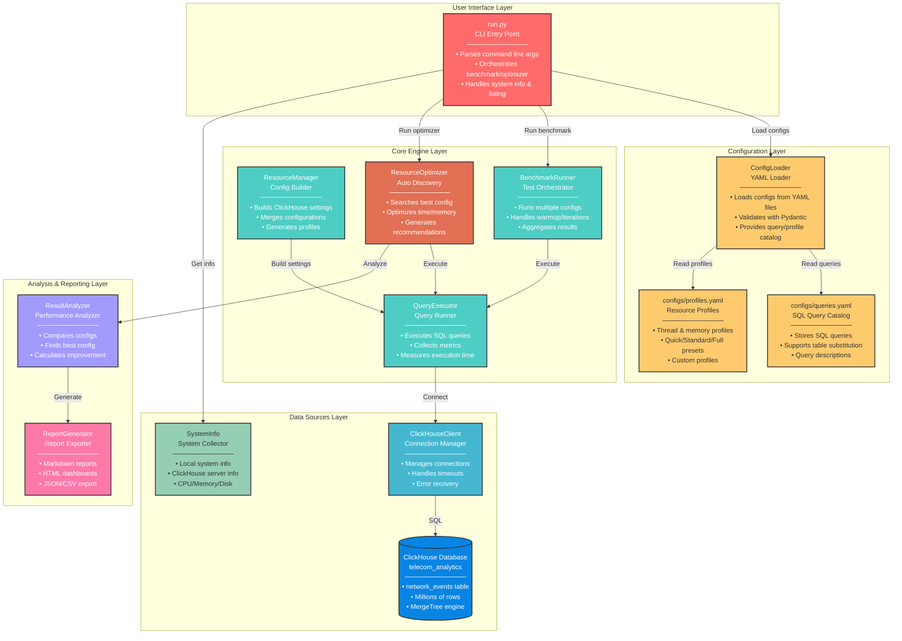

# ⚙️ CHForge - ClickHouse Performance Benchmark Framework
**CHForge is a professional framework for Benchmarking, Resource Management, and Performance Optimization in ClickHouse.** This tool helps you find the optimal resource configurations (thread count, memory allocation, and other settings) for your queries, enabling you to maximize performance and efficiency.


> ⚠️ **DISCLAIMER:** This project is designed for performance testing and benchmarking in controlled environments. Always test in a staging environment before applying any configurations to production systems. The authors are not responsible for any performance degradation or system issues caused by improper configuration.

---

## 📋 Table of Contents

- [Features](#-features)
- [Architecture](#-architecture)
- [Tech Stack](#-tech-stack)
- [Project Structure](#-project-structure)
- [Installation](#-installation)
- [Configuration](#-configuration)
- [Usage](#-usage)
- [CLI Commands](#-cli-commands)
- [Benchmark Results](#-benchmark-results)
- [Production Considerations](#-production-considerations)
- [Contributing](#-contributing)
- [License](#-license)

---

## ✨ Features

### 🚀 **ClickHouse-Powered Benchmarking**
- **Automatic resource optimization** - Find the best thread and memory configuration
- **Multi-query benchmarking** - Test different queries with different profiles
- **Real-time metrics collection** - Execution time, rows read, memory usage, and more

### 📊 **Comprehensive Analysis**
- **Performance comparison** - Compare configurations side-by-side
- **Auto-optimizer** - Automatically discover the best settings
- **Trend analysis** - Track performance over time
- **Outlier detection** - Identify anomalous runs

### 🖥️ **User-Friendly Interface**
- **Configuration-driven** - YAML-based settings, no code changes needed
- **Interactive CLI** - Simple commands for all operations
- **Flexible profiles** - Quick, Standard, Full, and custom profiles
- **System integration** - Get local and remote system information

### 🔧 **Production-Ready Features**
- **Connection management** - With timeout and error handling
- **Structured logging** - For debugging and monitoring
- **Type hints** - Better code documentation and IDE support
- **Modular architecture** - Easy to extend and customize

---

## 🏗️ Architecture



### Architecture Layers Explained

#### 1. **User Interface Layer**
- **`run.py`** : Unified CLI entry point with argparse support

#### 2. **Configuration Layer**
- **`ConfigLoader`** : Loads YAML configurations (connection, queries, profiles)
- **`queries.yaml`** : SQL query catalog with descriptions and table substitution
- **`profiles.yaml`** : Reusable resource configuration profiles

#### 3. **Core Engine**
- **`ResourceManager`** : Builds ClickHouse settings from configurations
- **`QueryExecutor`** : Executes queries and collects performance metrics
- **`BenchmarkRunner`** : Orchestrates benchmark runs across multiple configs
- **`ResourceOptimizer`** : Automatically discovers optimal configurations

#### 4. **Data Sources**
- **`ClickHouseClient`** : Connection manager with timeout handling
- **`SystemInfo`** : Collects local and remote system information

#### 5. **Analysis & Reporting**
- **`ResultAnalyzer`** : Compares and analyzes benchmark results
- **`ReportGenerator`** : Exports results to HTML, Markdown, or JSON

---

## 🛠️ Tech Stack

| Component | Technology | Version |
|-----------|------------|---------|
| **Language** | Python | 3.10+ |
| **Database** | ClickHouse | 26.4+ |
| **Client** | clickhouse-connect | 0.7.16+ |
| **Config** | PyYAML, Pydantic | 6.0+, 2.0+ |
| **Output** | Tabulate | 0.9.0+ |
| **System Info** | psutil | 5.9.0+ |

---

## 📁 Project Structure

```
CHForge/
│
├── run.py                          # Unified CLI entry point
├── requirements.txt                # Python dependencies
├── LICENSE                         # MIT License
├── README.md                       # This file
│
├── chforge/                        # Core package
│   ├── __init__.py
│   │
│   ├── client/                     # ClickHouse connection
│   │   ├── __init__.py
│   │   └── clickhouse_client.py    # Connection manager
│   │
│   ├── resources/                  # Resource configuration
│   │   ├── __init__.py
│   │   ├── config.py               # ResourceConfig dataclass
│   │   └── manager.py              # ResourceManager
│   │
│   ├── executor/                   # Query execution
│   │   ├── __init__.py
│   │   └── query_executor.py       # QueryExecutor with metrics
│   │
│   ├── benchmark/                  # Benchmark engine
│   │   ├── __init__.py
│   │   ├── runner.py               # BenchmarkRunner
│   │   └── optimizer.py            # ResourceOptimizer (auto-discovery)
│   │
│   ├── config/                     # Configuration loader
│   │   ├── __init__.py
│   │   ├── loader.py               # ConfigLoader (YAML)
│   │   └── models.py               # Pydantic models
│   │
│   ├── system/                     # System information
│   │   ├── __init__.py
│   │   ├── info.py                 # Local system info
│   │   └── clickhouse_info.py      # ClickHouse server info
│   │
│   └── utils/                      # Utilities
│       ├── __init__.py
│       └── logger.py               # Structured logging
│
├── configs/                        # YAML configuration files
│   ├── config.yaml                 # Connection & benchmark settings
│   ├── queries.yaml                # SQL query catalog
│   └── profiles.yaml               # Resource configuration profiles
│
├── Deprecated/                     # Old test scripts (no longer used)
│   ├── test_benchmark.bat
│   ├── test_benchmark.py
│   ├── test_optimizer.bat
│   ├── test_optimizer.py
│   ├── test_resources.bat
│   └── test_resources.py
│
└── venv/                           # Virtual environment
```

### 📄 File-by-File Explanation

| Path | Purpose |
|------|---------|
| **`run.py`** | Main CLI entry point. Handles argument parsing and orchestrates benchmark/optimizer runs. |
| **`chforge/client/clickhouse_client.py`** | Manages ClickHouse connections with timeout handling and error recovery. |
| **`chforge/resources/config.py`** | Defines `ResourceConfig` dataclass for thread/memory/timeout settings. |
| **`chforge/resources/manager.py`** | Builds ClickHouse settings, merges configs, generates profiles. |
| **`chforge/executor/query_executor.py`** | Executes queries and collects metrics (time, rows, bytes, memory). |
| **`chforge/benchmark/runner.py`** | Orchestrates benchmark runs across multiple configurations. |
| **`chforge/benchmark/optimizer.py`** | Automatically finds the best configuration for a query. |
| **`chforge/config/loader.py`** | Loads and parses YAML configuration files. |
| **`chforge/config/models.py`** | Pydantic models for type-safe configuration validation. |
| **`chforge/system/info.py`** | Collects local system information (CPU, RAM, Disk, Network). |
| **`chforge/system/clickhouse_info.py`** | Collects ClickHouse server information (version, uptime, resources). |
| **`chforge/utils/logger.py`** | Structured logging with console and file output. |
| **`configs/config.yaml`** | ClickHouse connection settings and benchmark defaults. |
| **`configs/queries.yaml`** | SQL query catalog with descriptions and table substitution. |
| **`configs/profiles.yaml`** | Resource profiles (quick, standard, full, memory_test). |

---

## 📦 Installation

### 1. Clone the Repository

```bash
git clone https://github.com/javad-hosseini/CHForge.git
cd CHForge
```

### 2. Create Virtual Environment

```bash
# Windows
python -m venv venv
venv\Scripts\activate

# Linux/Mac
python3 -m venv venv
source venv/bin/activate
```

### 3. Install Dependencies

```bash
pip install -r requirements.txt
```

### 4. Configure Connection

Edit `configs/config.yaml`:

```yaml
clickhouse:
  host: "192.168.247.128"  # Your ClickHouse server IP
  port: 8123
  database: "telecom_analytics"
  username: "default"
  password: ""

benchmark:
  default_iterations: 3
  default_warmup: 1
  default_objective: "time"
  timeout: 300
```

---

## ⚙️ Configuration

### Query Catalog (`configs/queries.yaml`)

Define your SQL queries:

```yaml
queries:
  heavy_agg:
    description: "Heavy aggregation on city, network, app"
    table: "network_events"
    sql: |
      SELECT 
        city, network_type, app_name,
        count() as total_events,
        avg(latency_ms) as avg_latency
      FROM {table}
      WHERE event_time > now() - INTERVAL 90 DAY
      GROUP BY city, network_type, app_name
      HAVING total_events > 100
      ORDER BY total_events DESC
      LIMIT 50
```

### Profile Catalog (`configs/profiles.yaml`)

Define resource profiles:

```yaml
profiles:
  quick:
    description: "Quick test with 2 configs"
    configs:
      - threads: 4
      - threads: 8

  full:
    description: "Full benchmark (threads + memory)"
    configs:
      - threads: 2
        memory: "2G"
      - threads: 4
        memory: "4G"
      - threads: 8
        memory: "8G"
      - threads: 16
        memory: "8G"
```

---

## 🎮 Usage

### Basic Commands

```bash
# List available queries
python run.py --list-queries

# List available profiles
python run.py --list-profiles

# Show local system information
python run.py --system-info

# Show ClickHouse server information
python run.py --clickhouse-info
```

### Run Benchmark

```bash
# Quick benchmark
python run.py --query light_agg --profile quick

# Standard benchmark
python run.py --query heavy_agg --profile standard --iterations 3 --warmup 1

# Full benchmark with memory
python run.py --query heavy_agg --profile full --iterations 5
```

### Run Optimizer

```bash
# Optimize for time
python run.py --optimize --query heavy_agg --objective time

# Optimize for memory
python run.py --optimize --query heavy_agg --objective memory
```

### Override Connection

```bash
python run.py --query heavy_agg --host 192.168.1.100 --database my_db
```

---

## 📋 CLI Commands

| Command | Description |
|---------|-------------|
| `--query, -q <name>` | Query name from `queries.yaml` |
| `--profile, -p <name>` | Profile name from `profiles.yaml` (default: standard) |
| `--iterations, -i <n>` | Number of iterations per config |
| `--warmup, -w <n>` | Number of warmup runs |
| `--optimize, -o` | Run optimizer instead of benchmark |
| `--objective <time/memory>` | Optimization objective |
| `--host <ip>` | Override ClickHouse host |
| `--database <name>` | Override ClickHouse database |
| `--list-queries` | List all available queries |
| `--list-profiles` | List all available profiles |
| `--system-info` | Show local system information |
| `--clickhouse-info` | Show ClickHouse server information |

---

## 📊 Benchmark Results

### Test Environment

| Component | Specification |
|-----------|---------------|
| **Host** | Windows 11 Pro, 8 threads, 11.69 GB RAM |
| **ClickHouse** | Ubuntu VM, 1 core, 8 GB RAM |
| **Dataset** | 1,000,000 rows |
| **Query** | Heavy aggregation (GROUP BY city, network, app) |

### Performance Comparison

| Config | Time | Improvement |
|--------|------|-------------|
| Worst (threads=2) | 0.067s | Baseline |
| Manual (threads=4) | 0.074s | -10% (slower) |
| Auto (threads=4, memory=4G) | **0.031s** | **54% faster** |

### Key Insights

- **Optimal config:** `threads=4, memory=4G`
- **Improvement:** 54% vs worst config
- **Query characteristic:** I/O or memory bound
- **Success rate:** 100% across 10 configurations

---

## 🏭 Production Considerations

> **⚠️ For accurate and meaningful benchmark results, CHForge should be run in a production-like environment:**

| Aspect | Recommendation |
|--------|----------------|
| **Infrastructure** | Physical or dedicated server (not VM) |
| **Resources** | Match production: RAM, CPU, disk I/O |
| **Network** | Local or low-latency to ClickHouse |
| **Isolation** | No other heavy workloads during benchmarks |
| **Dataset** | Production-sized data (millions to billions) |
| **Validation** | Always validate auto-optimizer results on production hardware |

Results from virtualized or constrained environments may not reflect real-world performance. The auto-optimizer provides valuable insights, but final configuration decisions should always be validated on production hardware.

---

## 🤝 Contributing

Contributions are welcome!

1. Fork the repository
2. Create a feature branch
3. Commit your changes
4. Push to the branch
5. Open a Pull Request

---

## 📝 License

This project is licensed under the MIT License - see the [LICENSE](LICENSE) file for details.

---

## 👤 Author

**Seyed Mohammad Javad Hosseini**
- GitHub: [@javad-hosseini](https://github.com/javad-hosseini)


---

## ⭐ Support

Give a ⭐️ if this project helped you!

---

**Built with ❤️ for ClickHouse Performance Optimization** 🚀